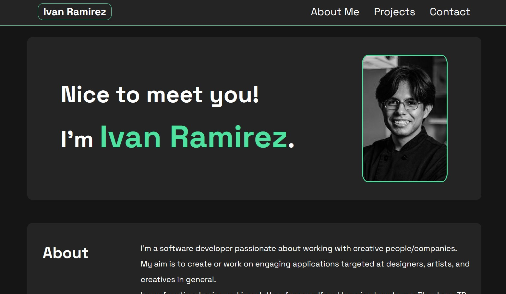

# Ivan's Portfolio Site

## Description

 This is a personal site meant to give a brief description of my aim as a developer. There are also links to projects (placeholders for now) that I've worked on as a developer and a contact section with links to my socials to get in touch.

 ## Usage

 This site can be viewed for information about me and the projects I've worked on. The navigation links in the top right will direct you to corresponding page sections. The images in the Projects section are clickable and will take you to the projects I've worked on (placeholders until I've worked on live projects). The links in the Contact section will direct you to my socials to connet with me.

 ## Page Link and Appearance

 [Visit my site!](https://navidliwa.github.io/portfolio-site/)

 

 ## License

 Licensed under the MIT License

